#### 代码未整理完成，暂未上传，可以先进群体验机器人。

<h1 align="center">
NGCBot
</h1>

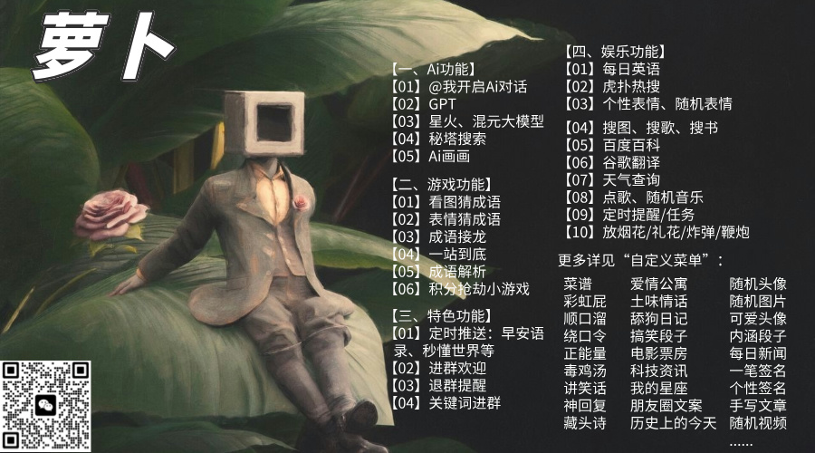

### 1. 项目简介

本项目 fork 自 [NGCBot](https://github.com/ngc660sec/NGCBot) ，基于该项目进行二次开发。代码比较随意，很多关键字、接口等未提至配置文件中。

### 2. 功能介绍

在原项目的基础上，功能或新增或移除，具体可通过 “菜单” 命令查询，以下仅列出部分功能：

#### 群聊功能

##### 超级管理员功能

1. 添加管理员
2. 删除管理员
3. 管理员功能
4. 自动转发公众号消息到推送群聊

##### 管理员功能
1. 管理群聊推送功能（定时推送、订阅公众号推送）
2. 管理群聊白名单（无积分限制）
3. 管理群聊黑名单（只有积分功能）
4. 管理公众号推送
5. 移除群聊成员
6. 增加、减少群聊成员积分
7. 管理员模式（仅响应管理员消息）

##### 普通用户功能
##### 积分功能
1. 签到、积分查询

   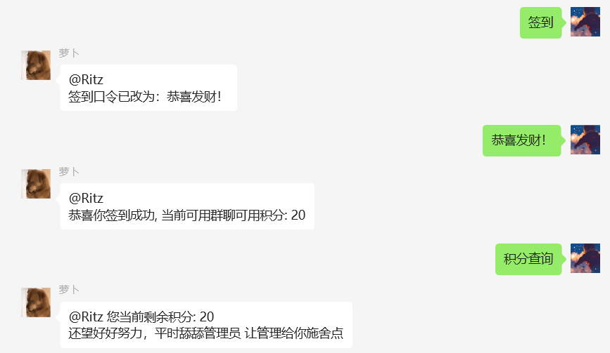

2. AI对话，包括GPT、星火、混元等模型

   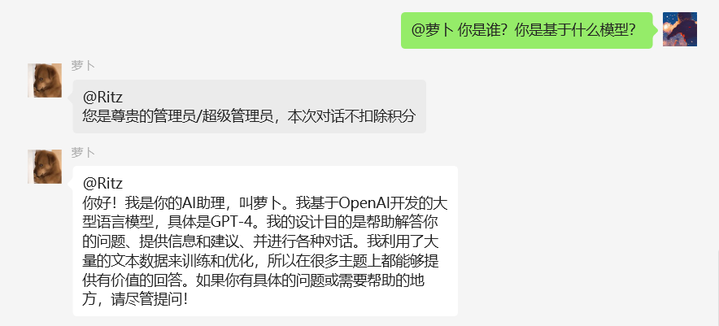

3. AI画画，包括星火等模型

   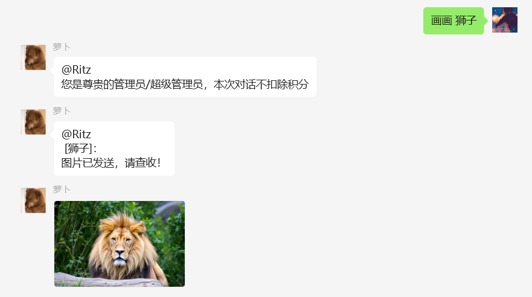

4. 秘塔搜索

   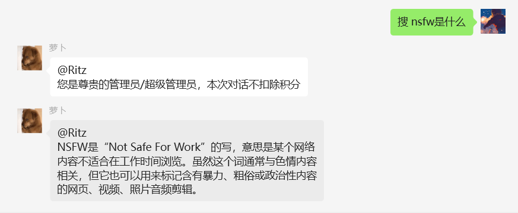

##### 娱乐功能
1. 舔狗日记

   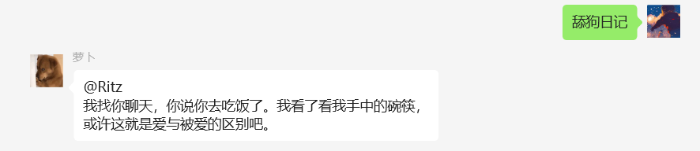

2. 毒鸡汤

   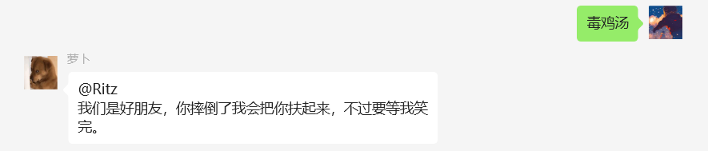

3. 讲笑话

   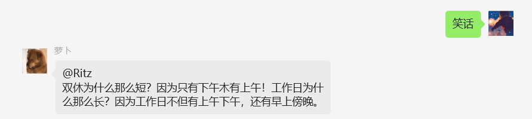

4. 讲段子

   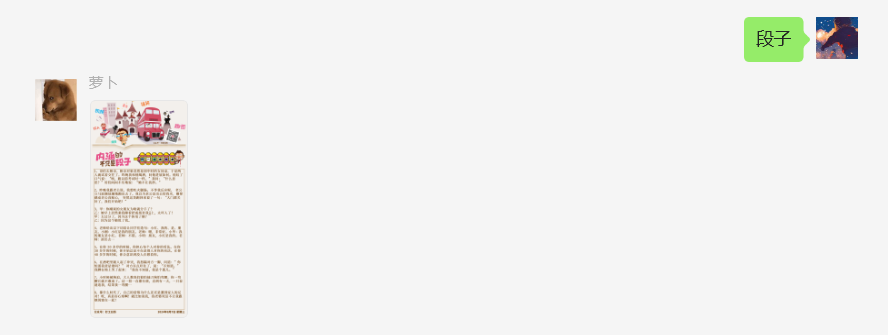

5. 神回复

   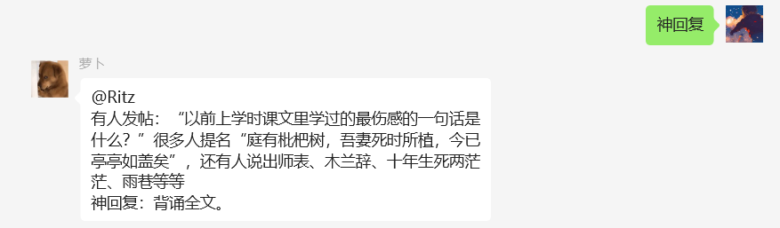

6. 每日英语

   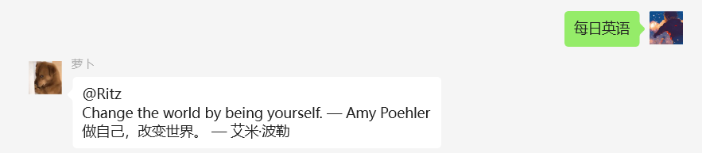

7. 秒懂世界

   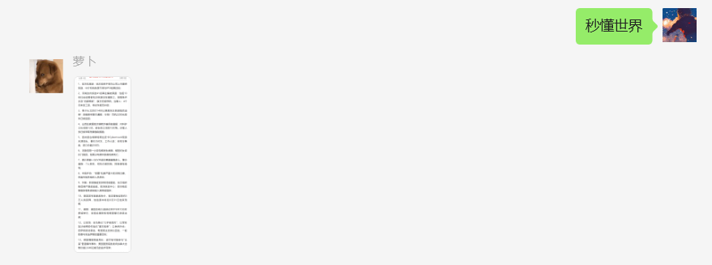

8. 虎扑热搜

   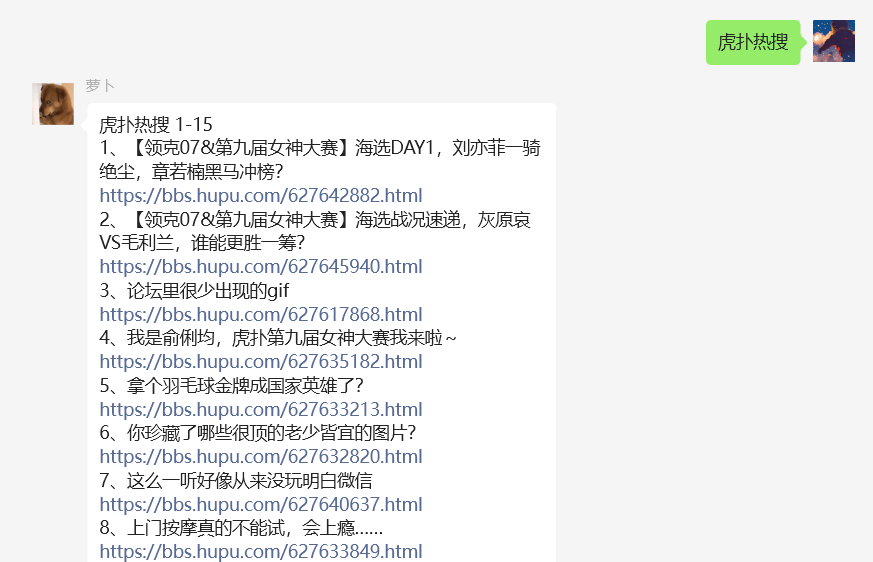

9. 个性表情、表情菜单

    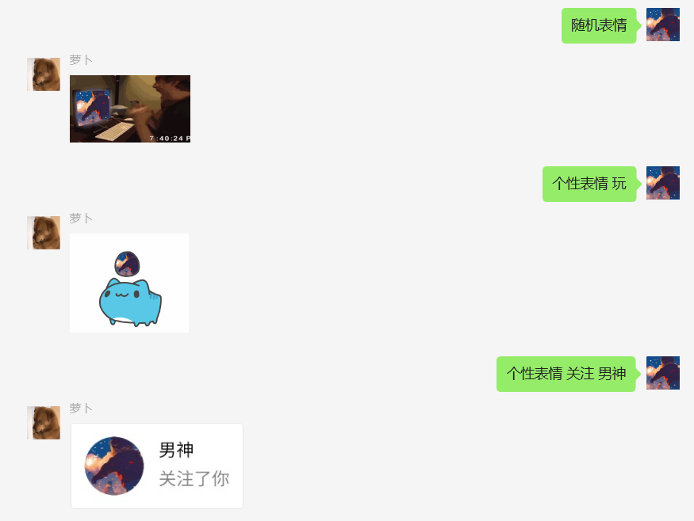

    

10. 点歌、搜歌

    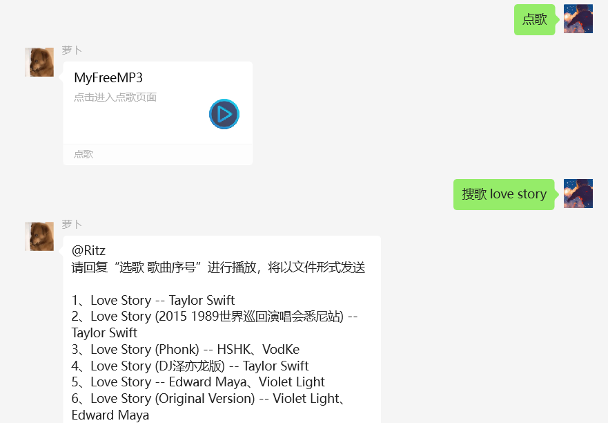

11. 搜图、

    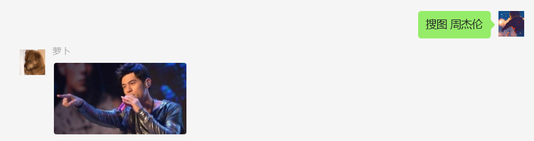

12. 翻译

    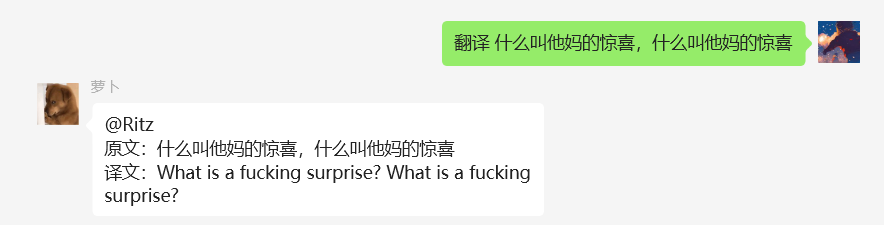

13. 天气查询

    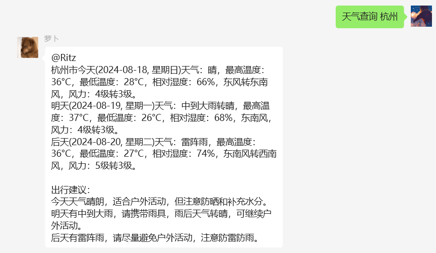

14. 定时提醒/任务

    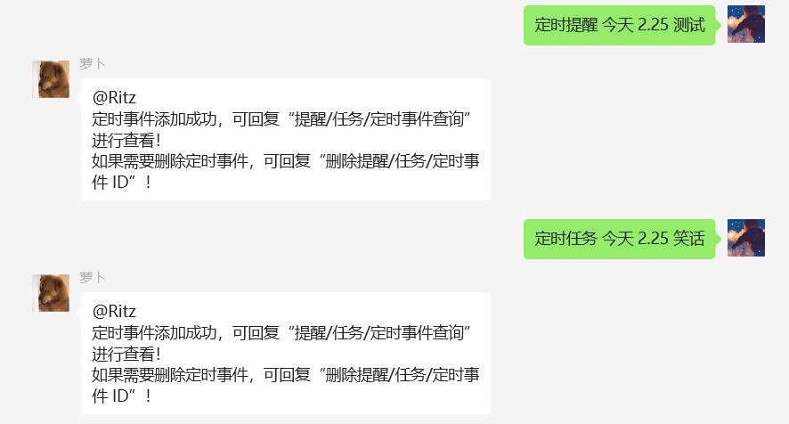

    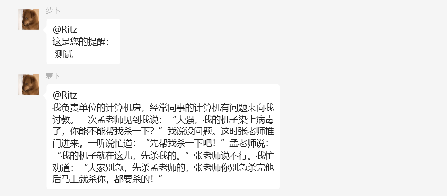

15. 总结推文

    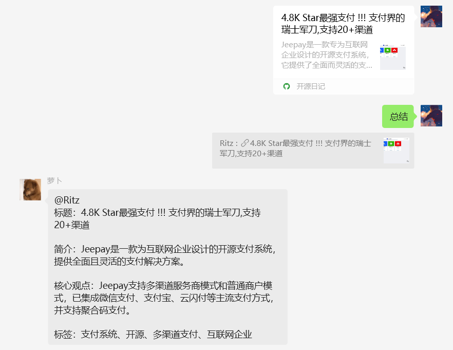

16. 美女图片/美女视频 🤫

#### 游戏功能
1. 看图猜成语

     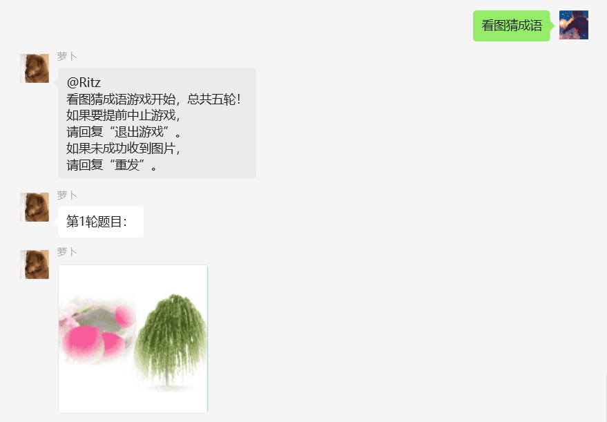

2. 表情猜成语

     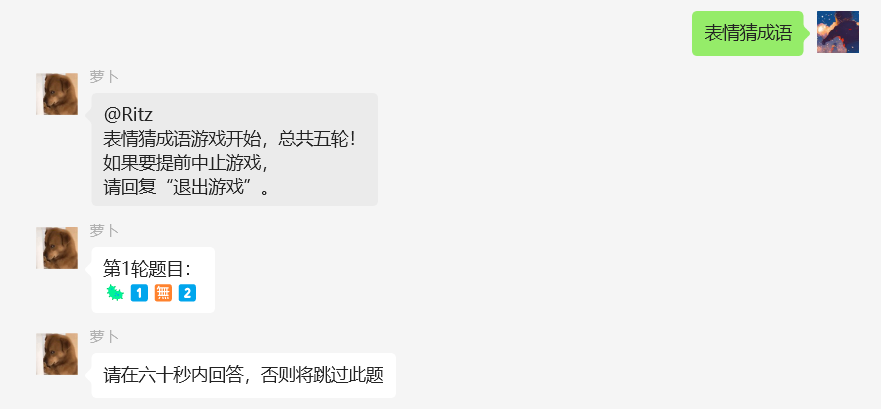

3. 成语接龙 

     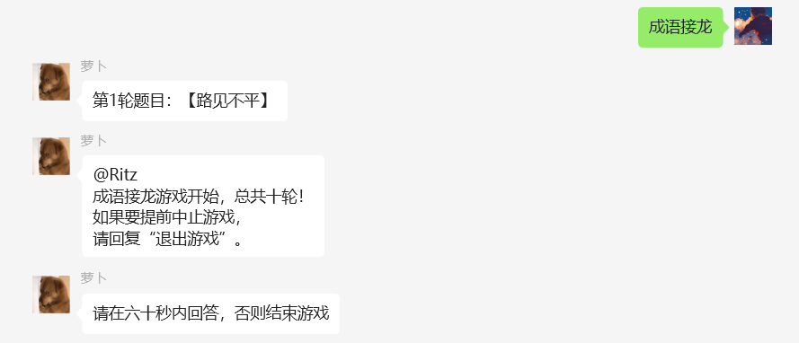

4. 成语查询

     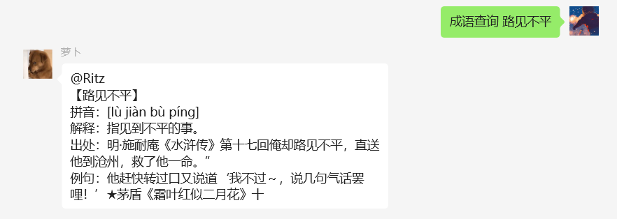

### 私聊功能
##### 常用功能
1. AI对话
2. 自动拉群
3. 自动同意好友请求
4. 自动转发公众号消息到推送群聊
4. 进群欢迎/退群提醒

### 3. 鸣谢

https://github.com/ngc660sec/NGCBot
感谢原作者的开源分享

### 4. 交流

**机器人微信：**

（进群一起耍，请发“进群”；接受租借服务，哈哈！）

